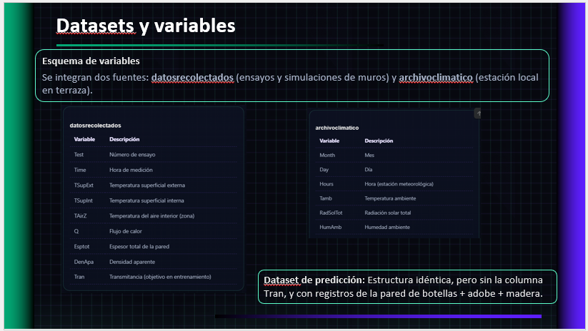
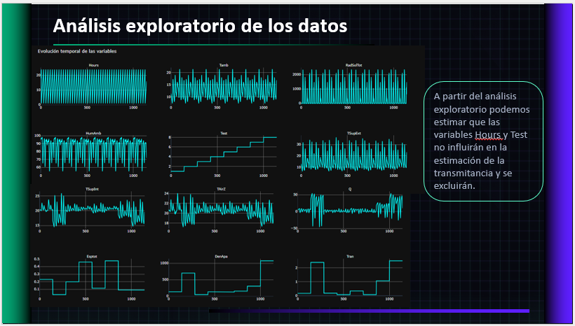
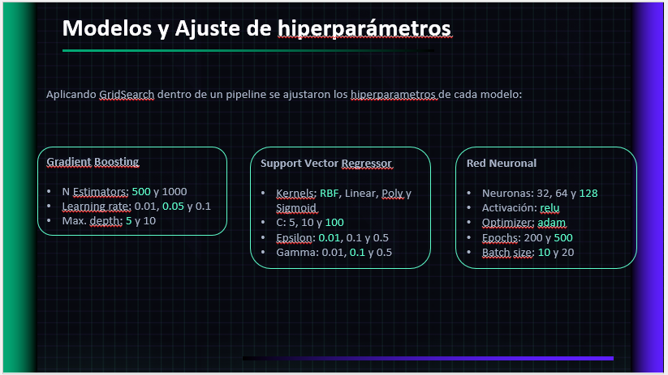
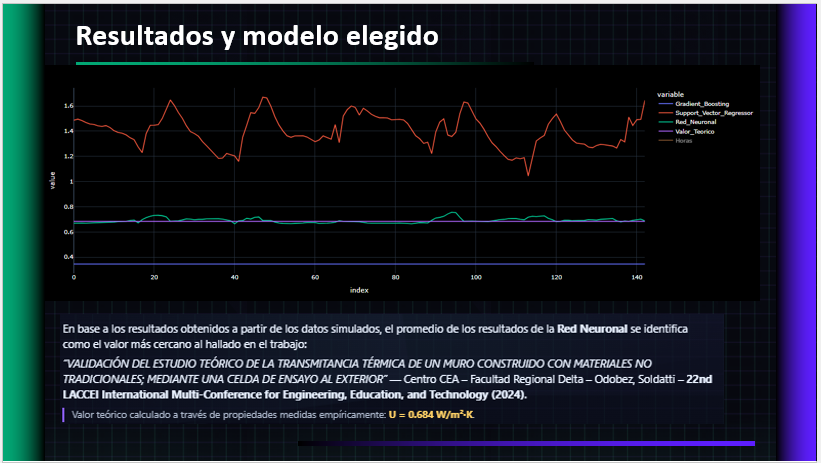
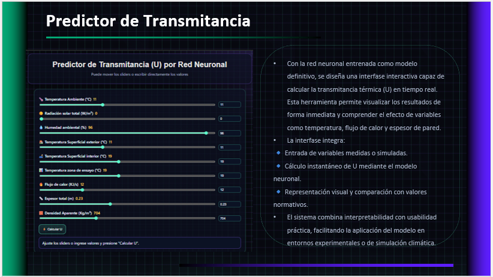

# 🌱 Data Science Project | Thermal Transmittance Prediction Model

## 🚀 Overview
This project presents a **Machine Learning-based predictive model** developed in **Python** to estimate **thermal transmittance (U-value)** of **non-conventional construction materials**.

The solution integrates **Data Science, Engineering Analytics, and Energy Efficiency**, enabling real-time prediction of thermal performance and reducing the need for **costly experimental testing**.

---

## 🎯 Business Problem  
Estimating thermal properties of materials requires complex experimentation, making it time-consuming and costly for engineering decision-making.

---

## ✅ Business Impact  
- Developed a predictive model to estimate material thermal performance  
- Reduced reliance on experimental testing for early-stage evaluation  
- Enabled faster decision-making in material design and selection  
- Provided data-driven insights for sustainable material optimization  

---

## 🎯 Business Context
In sustainable construction, many alternative materials lack reliable thermal performance data. This creates challenges for:

- Energy efficiency compliance  
- Building design validation  
- Cost-effective material selection  

This project was developed to:
- Enable **data-driven prediction of thermal properties**
- Reduce reliance on **experimental testing**
- Support **sustainable material adoption**
- Improve **energy efficiency analysis in construction**

---

## ⚠️ Data Disclaimer
This project uses a combination of:
- Experimental datasets (thermal tests and simulations)  
- Climate data (temperature, solar radiation, environmental variables)

Datasets are presented for demonstration purposes.

---

## 🧠 Solution Architecture

The project follows an **end-to-end Machine Learning pipeline**:

1. Data collection (experimental + climate data)  
2. Data preprocessing and cleaning  
3. Exploratory Data Analysis (EDA)  
4. Feature engineering and correlation analysis  
5. Model training and validation  
6. Hyperparameter tuning  
7. Deployment via interactive tool  

---

## 📊 Dataset Integration

Combined multiple data sources to improve predictive accuracy:

- Experimental thermal test data  
- Simulation data  
- Climate variables (temperature, radiation, environmental factors)

---

## 📈 Exploratory Data Analysis (EDA)

Performed detailed EDA to understand:
- Feature distributions  
- Correlations between variables  
- Data trends and anomalies  

---

## 🤖 Machine Learning Models

Evaluated multiple **regression models**:

- **Gradient Boosting**
- **Support Vector Regression (SVR)**
- **Artificial Neural Networks (ANN)**

---

## ⚙️ Model Optimization

Applied **GridSearchCV** for:

- Hyperparameter tuning  
- Model selection  
- Performance optimization  

Evaluation metrics:
- **R² Score**
- Accuracy
- Robustness to noise  

---

## 🏆 Results

The **Artificial Neural Network (ANN)** model achieved the best performance:

- High correlation with experimental results  
- Strong generalization capability  
- Robust predictions under variable conditions  

---

## 🖥️ Interactive Predictive Tool

Developed a tool for:

- **Real-time U-value estimation**
- Scenario simulation  
- Comparison with regulatory standards  

---

## 📊 Key Features
- **End-to-end Machine Learning pipeline**
- **Predictive modeling for engineering applications**
- **Integration of experimental and climate data**
- **Advanced regression techniques**
- **Hyperparameter optimization with GridSearchCV**
- **Interactive prediction tool**
- **Energy efficiency analysis**
- **Sustainability-focused modeling**

---

## 💼 Business Impact
- Reduced testing costs and time  
- Enabled **real-time thermal performance prediction**  
- Supported **sustainable material innovation**  
- Improved **decision-making in construction design**  
- Contributed to **energy efficiency optimization**  

---

## 🛠️ Tech Stack
- **Python**
- **Machine Learning**
- **Data Science**
- **Predictive Modeling**
- **Neural Networks**
- **Regression Analysis**
- **Scikit-learn**
- **EDA (Exploratory Data Analysis)**
- **Feature Engineering**
- **GridSearchCV**
- **Climate Data Integration**
- **Energy Efficiency Analytics**

---

## 📌 Key Skills Demonstrated
- **Machine Learning Engineering**
- **Predictive Modeling**
- **Data Analytics**
- **Feature Engineering**
- **Model Evaluation & Validation**
- **Engineering Data Analysis**
- **AI Applied to Energy Systems**
- **Sustainability Analytics**
- **Statistical Analysis**
- **Data Integration**

---

## 🔮 Future Improvements
- Deployment as a web application (Streamlit / API)  
- Expansion to additional material types  
- Integration with BIM tools and construction platforms  
- Advanced deep learning architectures  
- Real-time data pipeline integration  

---

## 📄 Notes
This project demonstrates the application of **Artificial Intelligence and Data Science in engineering and sustainability**, combining **predictive analytics, energy efficiency, and real-world impact**, aligned with roles in:

- Data Science  
- Machine Learning Engineering  
- Energy & Sustainability Analytics  
- Engineering Data Analysis  
